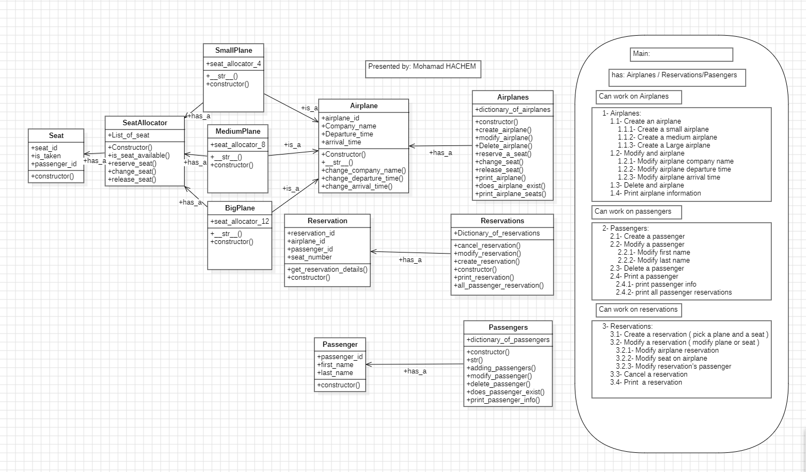
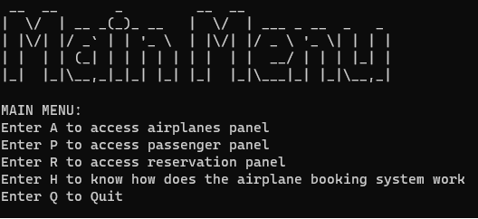
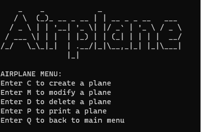
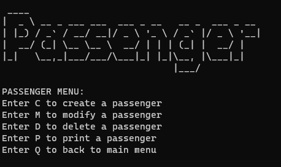
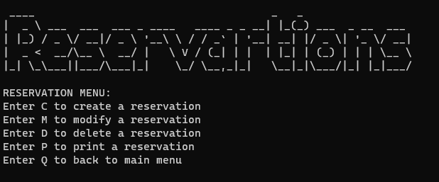

# Airplane Booking System

## Introduction
This Airplane Booking System is developed as a test for the Python Developer position at Onepoint. The system offers comprehensive functionalities to manage airplanes, passengers, and reservations.

## Table of Contents
- Introduction
- Features
- System Structure
- Installation & Setup
- Usage
- Contribution
- Contact Information

## Features
- Manage Airplanes:
  - Create different sizes of airplanes.
  - Modify airplane details such as company name, departure time, and arrival time.
  - Delete airplanes.
  - View airplane information.

- Manage Passengers:
  - Add passengers with personal details.
  - Update passenger information.
  - Remove passengers.
  - View passenger details and their reservation history.

- Manage Reservations:
  - Create reservations by selecting a plane and seat.
  - Modify reservation details.
  - Cancel reservations.
  - View reservation details.

## System Structure
The system is divided into three main sections:



### 1. Airplanes:
  - Create an airplane:
    - Create a small airplane.
    - Create a medium airplane.
    - Create a large airplane.
  - Modify an airplane:
    - Modify airplane company name.
    - Modify airplane departure time.
    - Modify airplane arrival time.
  - Delete an airplane.
  - Print airplane information.


### 2. Passengers:
  - Create a passenger.
  - Modify a passenger:
    - Modify first name.
    - Modify last name.
  - Delete a passenger.
  - Print a passenger:
    - Print passenger info.
    - Print all passenger reservations.


### 3. Reservations:
  - Create a reservation (pick a plane and a seat).
  - Modify a reservation:
    - Modify airplane reservation.
    - Modify seat on airplane.
    - Modify reservation's passenger.
  - Cancel a reservation.
  - Print a reservation.


## Installation & Setup
### Prerequisites:

1. **Git**: Ensure that Git is installed on your machine. If not, you can download and install it from [git-scm.com](https://git-scm.com/).

2. **Python**: This project is developed using Python. Make sure you have Python installed. If not, download and install it from [python.org](https://www.python.org/downloads/).
3. **Create a Virtual Environment**:
- Create a virtual environment to manage dependencies for a Python project. 
  ```
  python -m venv venv_name
  ```
- Activate the virtual environment:
  - On Windows:
    ```
    .\venv_name\Scripts\activate
    ```
  - On macOS and Linux:
    ```
    source venv_name/bin/activate
    ```
    
4. **Install Required Dependencies**:
- If you have a `requirements.txt` file in your repository (which lists all the dependencies for the project):
  ```
  pip install -r requirements.txt
  ```

5. **Run the Project**:
- Cd to the application, and then run:
  ```
  python -m main
  ```


